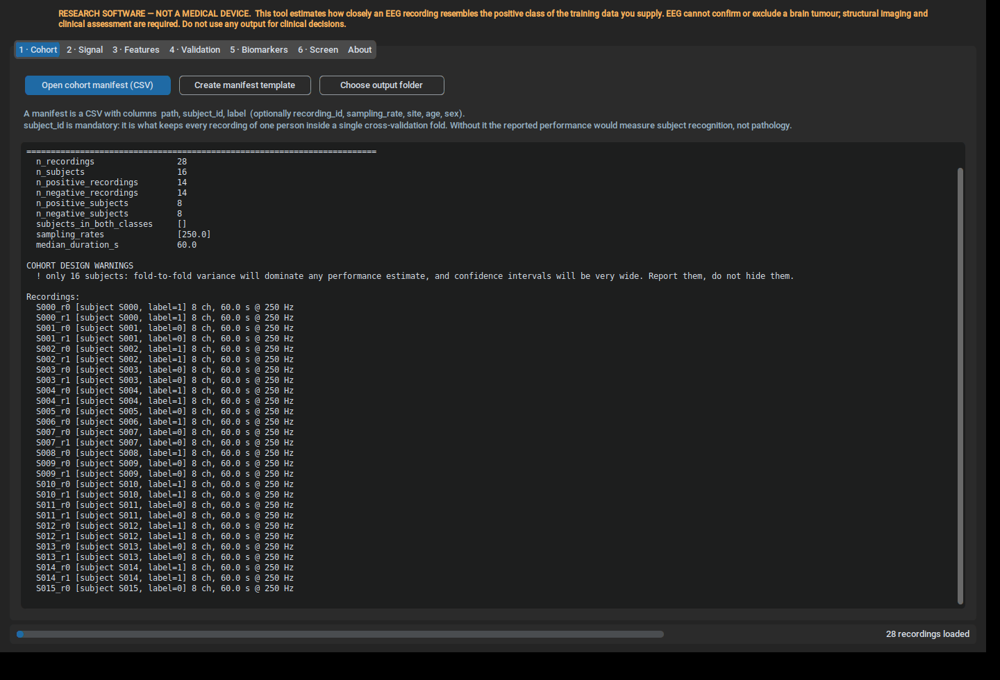
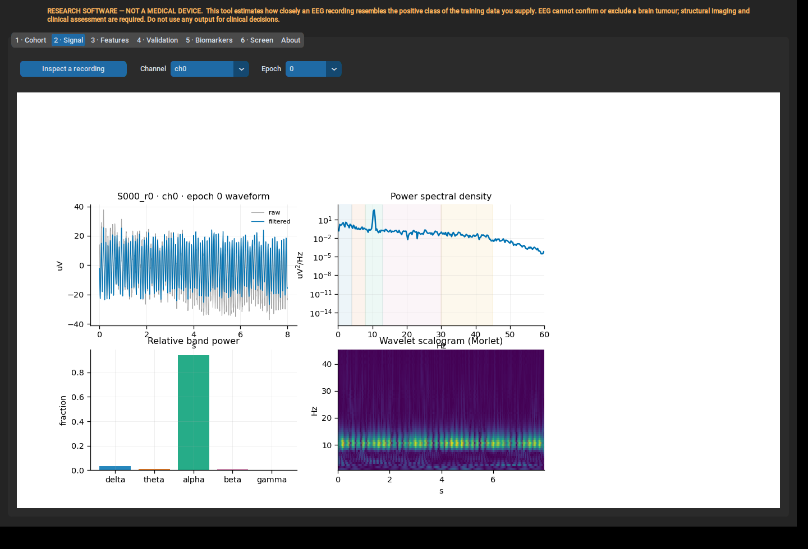
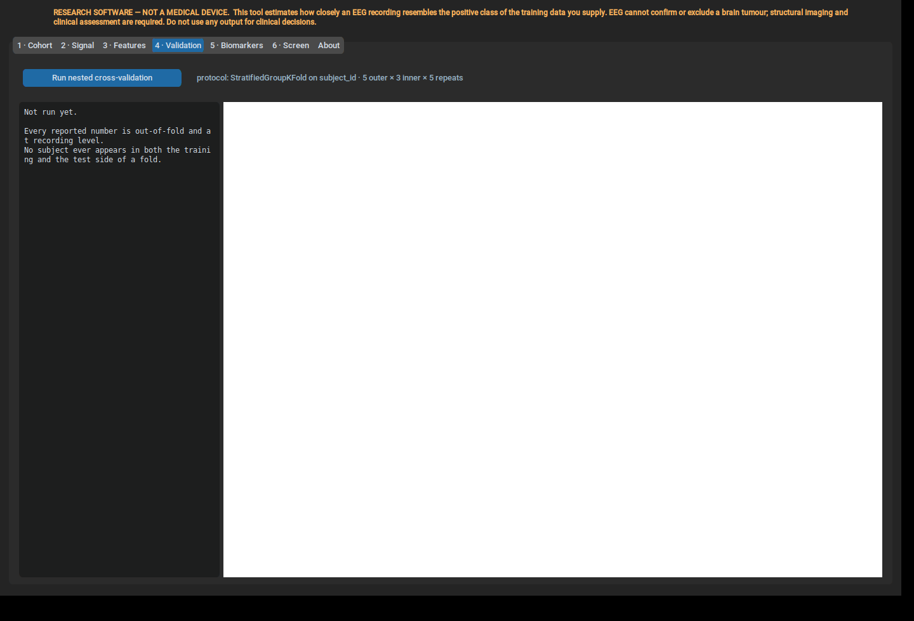
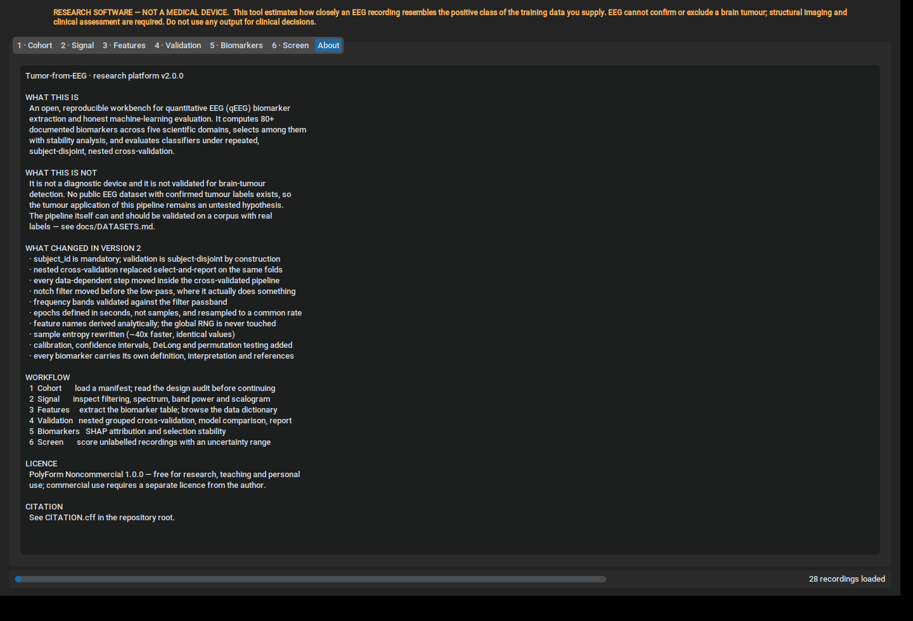
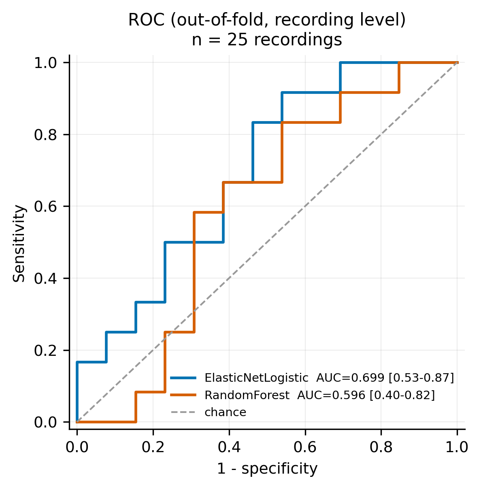
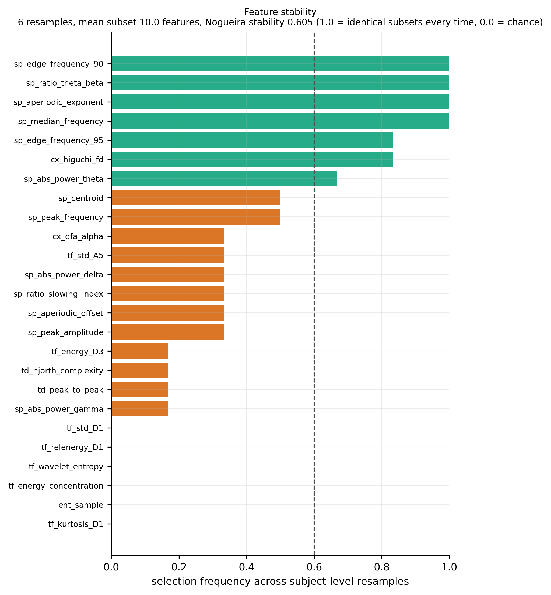
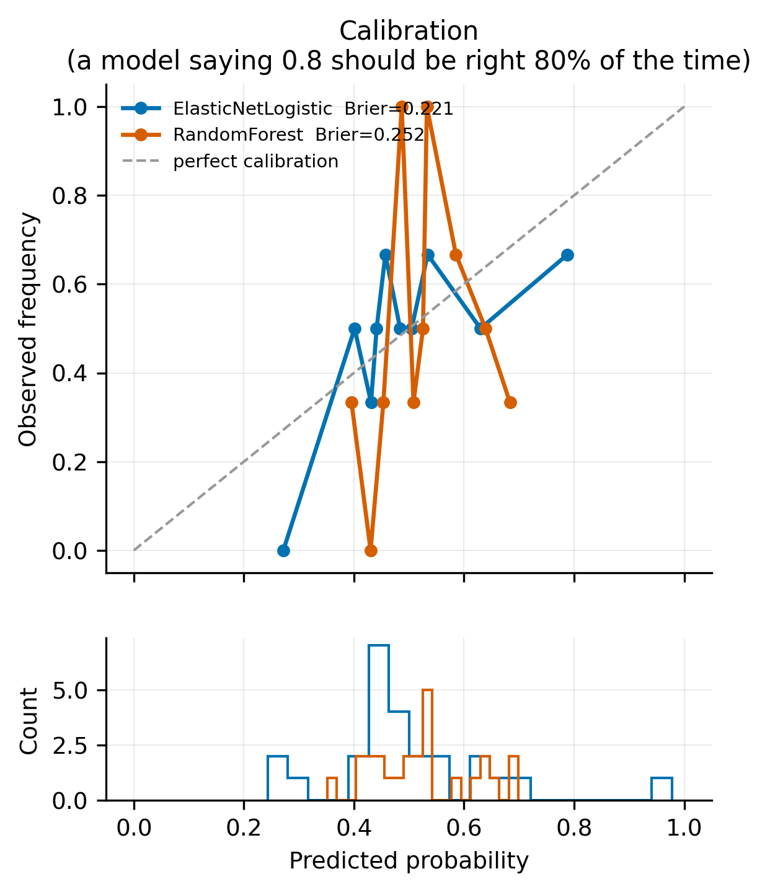
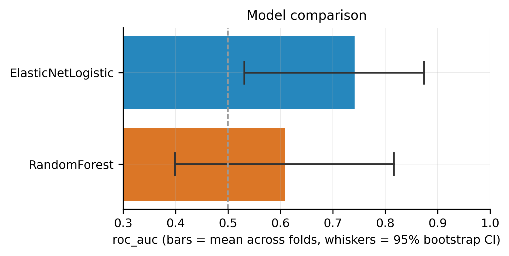

# 🧠Tumor-from-EEG

**A reproducible workbench for quantitative EEG biomarker extraction and honest
machine-learning evaluation**

[](https://github.com/soheilkooklan/Tumor-from-EEG/Action/.github/workflows/tests.yml) 


> **Research software — not a medical device.** This tool cannot diagnose a
> brain tumour and must not inform any clinical decision. Please read
> [DISCLAIMER.md](DISCLAIMER.md) before anything else.

---

## What this is

Version 2 is a rewrite. Version 1 was a GUI around a wavelet-and-ANN script; it
ran cleanly for a long time while producing numbers that measured nothing.

The rewrite began with a controlled experiment. A synthetic cohort was built in
which the class labels were **statistically independent of the signal** — 40
subjects, 19 channels each, labels assigned at random. The correct answer for
any honest protocol is ROC-AUC = 0.500. Version 1's protocol returned:

| Protocol | ROC-AUC on label-free data |
|---|---|
| v1: global scaler + channel-level `StratifiedKFold` | **0.957 ± 0.010** |
| v2: subject-disjoint `StratifiedGroupKFold` + fold-internal pipeline | 0.398 ± 0.230 |

Version 1 was not detecting pathology. It was recognising *which person* a
channel came from, because channels from one subject were split across training
and test folds. This is the record-wise/subject-wise error (Saeb et al., 2017),
and it is the most common leakage type in ML-based science (Kapoor & Narayanan,
2023).

Everything in version 2 follows from taking that seriously.

**What the software does:** computes 81 documented qEEG biomarkers across five
scientific domains, selects among them with stability analysis, and evaluates
classifiers under repeated, subject-disjoint, nested cross-validation with
calibration, confidence intervals and significance testing.

**What it does not do:** tell you that someone has a brain tumour. See
[docs/LIMITATIONS.md](docs/LIMITATIONS.md), which is written against this
project's own interests.

---

## Screenshots

| Cohort — load, audit, inspect | Signal — filtering, spectrum, scalogram |
|---|---|
|  |  |

| Validation — nested grouped CV | About — scope and limits |
|---|---|
|  |  |

Screenshots are regenerated from the running application by
`tools/capture_screenshots.py`, so they cannot drift away from the software.

---

## Install

```bash
git clone https://github.com/soheilkooklan/Tumor-from-EEG.git
cd Tumor-from-EEG
pip install -r requirements.txt
pytest -q                     # 32 tests, all should pass
```

Python 3.10 or newer. Only the core block of `requirements.txt` is needed to
run an analysis; XGBoost, LightGBM, SHAP, MNE and CustomTkinter are optional and
the software degrades gracefully with a message when they are absent.

---

## Quick start

No clinical data ships with this repository. Generate a synthetic cohort with a
known, controlled effect:

```bash
python examples/make_demo_cohort.py --out demo_data --effect 0.7 --subjects 24
python -m eegtumor.cli audit --manifest demo_data/cohort.csv
python -m eegtumor.cli run   --manifest demo_data/cohort.csv --out results/
```

Then run the negative control, which matters more:

```bash
python examples/make_demo_cohort.py --out demo_null --effect 0.0 --subjects 24
python -m eegtumor.cli run --manifest demo_null/cohort.csv --out results_null/
```

With `--effect 0.0` the labels carry no information at all. A correct pipeline
must return ROC-AUC near 0.5. **If it returns 0.9, something is leaking — do not
trust any other result from that installation.**

Graphical interface:

```bash
python main.py
```

---

## Your own data

A cohort is defined by a CSV manifest. `subject_id` is mandatory: it is what
keeps every recording from one person inside a single cross-validation fold.

```csv
path,subject_id,label,recording_id,sampling_rate,site,age,sex
recordings/p01_a.edf,P01,0,,,siteA,54,F
recordings/p01_b.edf,P01,0,,,siteA,54,F
recordings/p02_a.edf,P02,1,,,siteA,61,M
data/control_07.csv,C07,0,,250,siteB,49,F
```

Supported formats: EDF, BDF, CSV, TSV, MAT, NPY, NPZ. Sampling rate is read from
EDF/BDF headers and must be supplied in the manifest for the others — it cannot
be inferred, and a wrong value silently invalidates every spectral feature.

Always audit first:

```bash
python -m eegtumor.cli audit --manifest cohort.csv
```

This flags the structural confounds that no amount of correct cross-validation
can fix: classes recorded at different sampling rates, class-correlated
recording durations, subjects appearing in both classes, mismatched montages,
insufficient subject counts.

---

## Method summary

Full detail in [docs/METHODS.md](docs/METHODS.md).

**Preprocessing.** Resample to a common rate → DC removal → mains notch
(*before* the low-pass, where it actually does something) → zero-phase
second-order-section band-pass, default 0.5–45 Hz → common average reference →
epoching in **seconds** → per-epoch quality control with recorded reasons.
Frequency bands are validated against the filter passband at configuration time,
so requesting 30–45 Hz gamma through a 1–30 Hz filter raises an error instead of
returning filter roll-off.

**Features.** 81 biomarkers in five domains, each carrying its own definition,
physiological interpretation, references, complexity and amplitude dependence —
exported as `feature_dictionary.csv` with every run.

| Domain | n | Notes |
|---|---|---|
| Time | 17 | moments, RMS, line length, Hjorth, Teager energy |
| Spectral | 27 | multitaper PSD, band power and ratios, spectral edge, **aperiodic 1/f exponent** |
| Time–frequency | 26 | DWT sub-band energy, SD, kurtosis, wavelet entropy |
| Entropy | 5 | sample (k-d tree, ~40× faster), permutation, multiscale |
| Complexity | 6 | Higuchi/Katz/Petrosian FD, DFA, Hurst, Lempel-Ziv |

The features are **not equally defensible**, and the documentation says so. The
classical scalp correlate of a structural lesion is focal slowing, so the band
ratios — especially `sp_ratio_slowing_index`, (δ+θ)/(α+β) — carry real clinical
literature behind them. The entropy and complexity families are exploratory and
flagged as such.

**Selection.** A staged funnel (variance → correlation → mutual information →
embedded importance → cap), implemented as a scikit-learn transformer so it is
refitted inside every training fold. Selection frequency across subject-level
resamples is reported with the Nogueira stability index.

**Validation.** Optuna hyper-parameter search in an inner subject-disjoint loop,
performance estimated on outer folds the tuning never saw, repeated across
seeds. Probability calibration, epoch→recording aggregation, bootstrap
confidence intervals, DeLong and McNemar tests between models, and a
subject-level label-permutation null.

**Explainability.** Exact SHAP where the model family allows it — `TreeExplainer`
for forests, `LinearExplainer` for linear models — falling back to the
model-agnostic explainer only when necessary. SHAP describes the model, not the
biology.

---

## Example output

Every run writes a timestamped, config-hashed directory containing the exact
configuration used, the environment, the full feature table, the feature
dictionary, metrics, model comparisons, stability, figures in PNG and PDF, and a
self-contained HTML report.

| ROC (out-of-fold, recording level) | Selection stability |
|---|---|
|  |  |

| Calibration | Model comparison |
|---|---|
|  |  |

*These figures come from the synthetic demo cohort, not from clinical data.*

Note the width of the intervals. On a small cohort a 95 % CI on ROC-AUC
routinely spans 0.4. That width is the result, not a presentational problem.

A published analysis should be reproducible from the manifest plus the emitted
config alone:

```bash
python -m eegtumor.cli run --manifest cohort.csv \
                           --config results/run_.../config_used.yaml \
                           --out reproduction/
```

---

## Repository layout

```
eegtumor/
  config.py          analysis configuration + consistency validation
  io.py              readers (EDF/BDF/CSV/MAT/NPY) + Cohort + design audit
  preprocessing.py   filtering, resampling, epoching, quality control
  features/          registry + five biomarker domains, self-documenting
  selection.py       staged selection funnel + stability analysis
  modeling.py        model zoo, leakage-safe pipeline, calibration, aggregation
  validation.py      nested grouped CV, metrics, bootstrap, DeLong, McNemar
  explain.py         SHAP and grouped permutation importance
  reporting.py       publication-quality figures + HTML report
  experiment.py      orchestration of a complete run
  cli.py             reproducible command-line entry point
  gui.py             seven-tab graphical interface
tests/               32 tests: estimator correctness + leakage regression
docs/                METHODS, DATASETS, LIMITATIONS, MIGRATION
examples/            synthetic cohort generator (including the null control)
tools/               screenshot capture
legacy/              version 1, preserved
```

---

## Adding a biomarker

Feature families register themselves. Adding one means adding one module and one
`register_group` call — no existing file changes:

```python
# eegtumor/features/my_domain.py
from . import FeatureGroup, FeatureSpec, register_group

def names(fcfg, bands):  return ["my_feature"]
def docs(fcfg, bands):   return {"my_feature": FeatureSpec(
    name="my_feature", domain="spectral",
    description="…", interpretation="…",
    references=("Author et al. 2024",), complexity="O(n)")}
def compute(x, fs, fcfg, bands):
    from collections import OrderedDict
    return OrderedDict([("my_feature", float(...))])

register_group(FeatureGroup("my_group", "spectral", names, compute, docs))
```

A group must declare its output names **before seeing data**, which is what
guarantees a fixed-width feature matrix.

---

## Datasets

There is no public EEG dataset with confirmed brain-tumour labels. The tumour
application of this pipeline is an untested hypothesis.

The pipeline itself can and should be validated on a corpus that has real labels
and subject-disjoint splits — the TUH Abnormal EEG Corpus is the obvious choice.
Published accuracy there is around 85–89 %, on a much easier task with far more
data. Keep that anchor in mind when reading any claim of 95 %+ tumour detection
from a few dozen recordings.

See [docs/DATASETS.md](docs/DATASETS.md).

---

## Contributing

Issues and pull requests are welcome, particularly for connectivity and graph
features, montage harmonisation, additional readers, and validation runs on
public corpora.

Two requirements: `pytest -q` must pass, and any change touching preprocessing,
selection or validation must keep `tests/test_leakage.py` green. That file exists
specifically so the version 1 defect cannot come back.

---

## Licence

**PolyForm Noncommercial 1.0.0** — free for research, teaching, personal study
and use by charitable, educational, public research, health and government
organisations, regardless of funding source. Commercial use requires a separate
licence from the author.

Version 1 was released under the MIT licence and remains MIT; that grant is
irrevocable for the code it covered. See [CHANGELOG.md](CHANGELOG.md) and
`LICENSE-v1-MIT.txt`.

Note that a noncommercial licence is not OSI-approved open source.

---

## Citation

See [CITATION.cff](CITATION.cff), or:

> Kooklan, S. (2026). *Tumor-from-EEG: a reproducible workbench for quantitative
> EEG biomarker extraction and subject-disjoint machine-learning evaluation*
> (Version 2.0.0) [Computer software].
> https://github.com/soheilkooklan/Tumor-from-EEG

---

## Key references

Saeb et al. (2017) *GigaScience* 6(5) · Kapoor & Narayanan (2023) *Patterns* 4(9)
· Ambroise & McLachlan (2002) *PNAS* 99(10) · Nogueira et al. (2018) *JMLR* 18
· Donoghue et al. (2020) *Nat Neurosci* 23 · Thomson (1982) *Proc IEEE* 70(9) ·
Richman & Moorman (2000) *Am J Physiol* 278 · Higuchi (1988) *Physica D* 31 ·
Hjorth (1970) *Electroencephalogr Clin Neurophysiol* 29 · Gloor et al. (1977)
*Neurology* 27(4) · Finnigan & van Putten (2013) *Clin Neurophysiol* 124(1)

Full list in [docs/METHODS.md](docs/METHODS.md).
